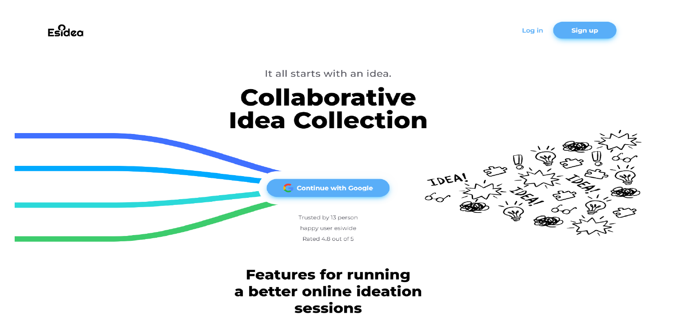

# ESIDEA - Collaborative Ideation Platform for ESI

ESIDEA is a full-stack web application developed as part of a multidisciplinary project at ESI. The platform is designed to facilitate **idea collection and development** for pedagogical projects using collaborative ideation methods like **brainstorming** and **brainwriting**.




## 🌐 Live Access (if deployed)
To run locally, see [Installation](#installation).

---

## 📌 Features

- ✍️ Project creation using ideation methods (Brainstorming & Brainwriting)
- 🧠 Real-time collaborative ideation
- 🧑‍🤝‍🧑 Invite collaborators by email
- 🗃️ Organize projects with modules, clubs, or events
- 💬 AI-powered chatbot for idea support
- 📊 Admin dashboard for stats and user management
- 🔐 Google OAuth & email/password authentication
- 🧾 Export final ideation in PNG format
- ⚙️ Profile customization & feedback system

---

## 🛠️ Tech Stack

### Frontend:
- React.js
- TailwindCSS
- TypeScript
- Axios
- Socket.io

### Backend:
- Node.js
- Express.js
- TypeScript
- MongoDB + Mongoose
- Google OAuth
- JWT

### Tools:
- Docker
- Postman
- Figma (UI/UX Design)
- ClickUp, Lucidchart, Google Suite (Documentation & PM)

---


## ⚙️ Installation and running

> Prerequisites:
- Docker Desktop (with WSL2)
- Virtualization enabled
- 4 GB RAM or more

### 🐳 Quick Start (Windows):
1. Clone the repo and navigate to `docker/`:
```bash
cd docker/
```
2. Run 
```bash
Load&runEsidea.bat  # First time setup
# or
runEsidea.bat        # For subsequent runs
```

3. Open your browser and go to : http://localhost:5174


## 📖 Usage

- Create or log in using your `@esi.dz` email
- Create and manage projects
- Collaborate in real-time on ideation sessions
- Admins can manage users, moderate content, and view insights

For detailed usage instructions, refer to:

- [📙 Guide d'utilisation (NoticeUtilisation.pdf)](docs/NoticeUtilisation.pdf)

---

## 👥 Contributors

| Name                                  | Role                |
|---------------------------------------|---------------------|
| **MOSTEFAI Mounir Sofiane**           | Team Leader         |
| **KHALEF Badis**                      | Backend & Design    |
| **BOUGUESSA Wail**                    | Backend & Frontend  |
| **CHABBI Ahcen**                      | Frontend            |
| **GUEROUMI Mohamed Lamine Bahaa Eddine** | Frontend         |
| **TALEB Mohamed Adnane**             | Infrastructure       |

---

## 📄 License

This project is intended for educational purposes at ESI.  
Please contact the contributors for any reuse or reproduction requests.

---

## 📚 Documentation

- [📘 Rapport du Projet (Rapport.pdf)](docs/ESIDEA_Rapport.pdf)
- [⚙️ Guide d'installation (NoticeInstallation.pdf)](docs/ESIDEA_NoticeInstallation.pdf)
- [📙 Guide d'utilisation (NoticeUtilisation.pdf)](docs/ESIDEA_NoticeUtilisation.pdf)

